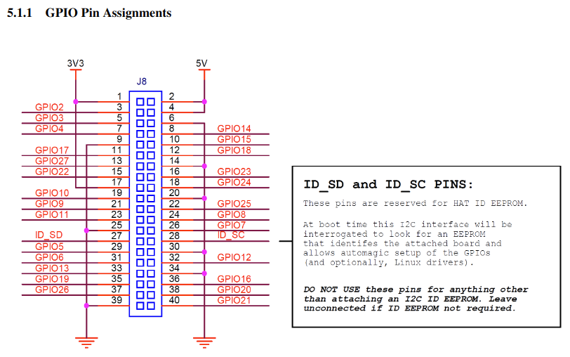
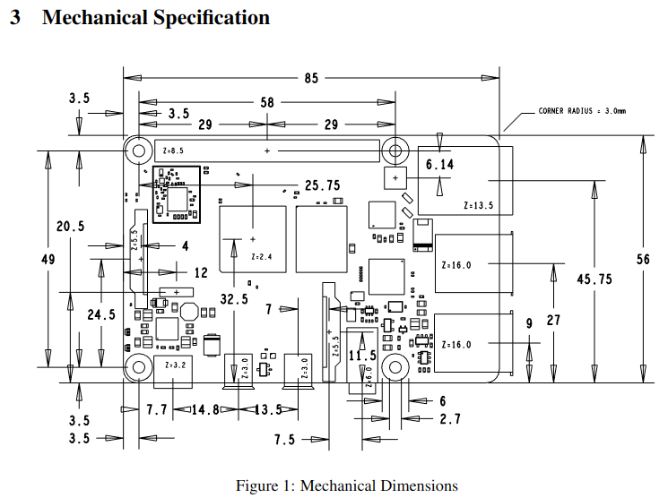
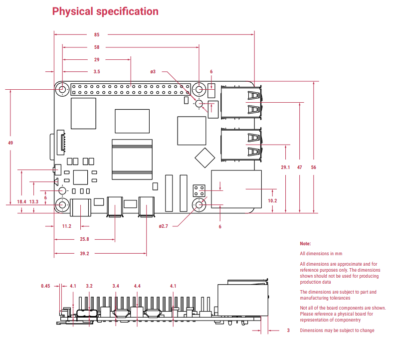

# ARC Teams
## 目次
・[Raspberry Pi](./README.md#raspberry-pi)  
　
# Raspberry Pi
・[Raspberry Pi 4 データシート](./documents/raspberry-pi-4-datasheet.pdf)  
・[Raspberry Pi 5 データシート](./documents/raspberry-pi-5-datasheet.pdf)
## Raspberry pi 4/5 GPIO MAP

## Raspi4 構成図

## Raspi5 構成図

## Raspberry Pi pigpio
・[Reference](https://abyz.me.uk/rpi/pigpio/index.html)  

Install  
```
sudo apt update
sudo apt install -y pigpio
```
Usage
```
gcc -o file.o file.c -lpigpio
```